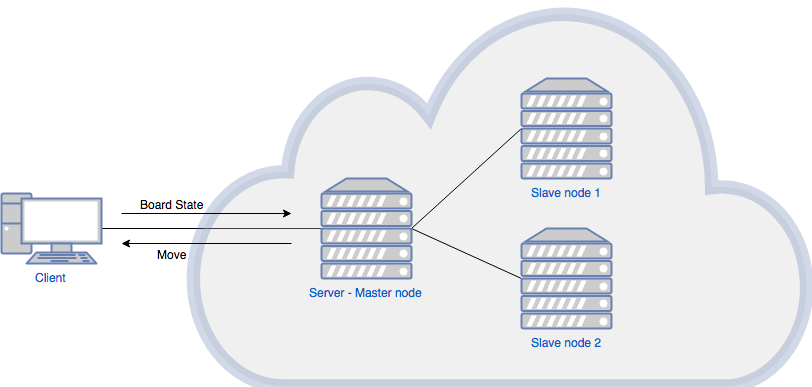
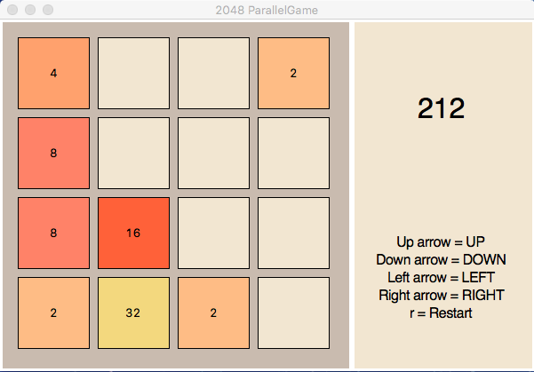
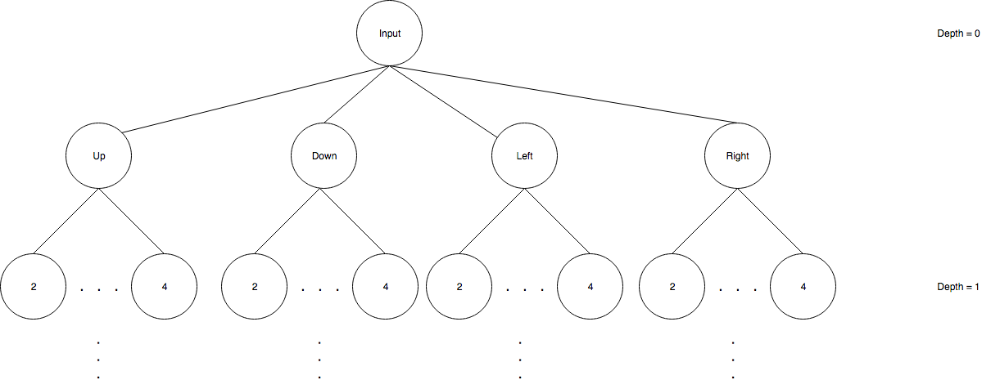
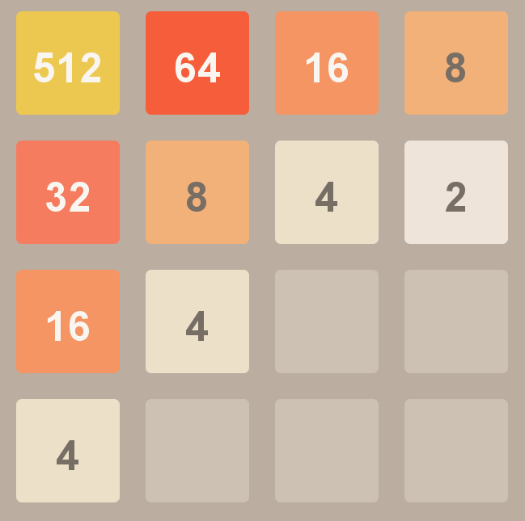

# Parallel Computation on Cloud : 2048 game AI
___

1. Introduction
2. Methodologies
   * Communication Architecture    
   * Client side model  
   * Server side model
   * AI Model
4. Discussion
   * Discussion on performance
   * Discussion on implementation
       * cloud configuration
       * client
           - github client
       * server
           - github server
   * How to use this project
5. Conclusion
6. Acknowledgement
   * contributors
   ___

## Abstract
This project simulates scientific computing using high performance computing(HPC) by using virtual machines on cloud as a cluster of computing nodes and 2048 game AI as computational task. The AI algorithm is implemented as bruteforce manner in order to evaluate full potential of parallel computation. The paralell program use map-reduce model to do parallel computation. Then contrasted the execution time with linear program to show advantage of parallel computation. 
___

## Introduction

Nowadays, Cloud Technologies is becoming a new standard of providing services. Many people are using Cloud Technologies without realizing, for example, many web-applications are running on cloud virtual machines, or your data are being stored within a cloud storage. There are more services that cloud services provider provides, but they could be categorized into 3 categories;
   1. Infrastructure as a service(IaaS) - virtual machines, cloud persistance drive
   2. Platform as a service(PaaS) - Bitnami Database services, IBM Watson
   3. Software as a service(SaaS) - Google Docs, Google BigQuery

Many businesses shift toward using those services on cloud. Co-location and On-premises machines are becoming less popular and are being used to serve some specific purposes only.

The aim of this project is to simulate creating and using High Performance Computing(HPC) to calculate complex scientific calculation. In this project we decided to use Google Compute Engine , which is a virtual machine service that Google Cloud Platform provides, as computing nodes. And we created a simple AI program to calculate best move for 2048 game as the scientific computation. User mays use personal computer with GUI to see the robot play the game.
___


## Methodologies

### Communication Architecture



### Client Side
At the client side, the clien side script, implemented in python,is running 2048 Game GUI and send board state to the server using SocketAPI to communicate with the server.



### Server Side
The master node will generate a tree of possible states(tasks) and calculate probabilty of each state then distribute to slaves nodes to evaluate hueristic score. Then master will reduce the maxmimum score from each node and send the best move back to the client using SocketAPI.


We could calculate the upperbound of the number of tasks by
$$ upperbound(depth = d, availableholes = h) = 8^{d} * P(h,d) = \frac{h!}{(h-d)!}$$
Assume
1. Half of the board is occupied
2. No merge happens  

Thus, averagely 16 holes are available. Then the upperbound of the number of tasks when depth is 3 is 172,032 possibilities.

In this project, we experiment only with __4x4__ board with depth = __3__.


### AI Model
To imitate scientific computation, we decided to create a simple AI that bruteforce through all possible states and select the best evaluation score.

#### Desirable Board
The board that will reach higher score is the board that creates symmetric along the diagonal of the board and descend from higher tiles from only 1 corner.
Such as this board.


The method we did is to do matrix multiplication between sloped matrix and the board then find 1-norm.

Define moved board as

<a href="https://www.codecogs.com/eqnedit.php?latex=\inline&space;\dpi{100}&space;\large&space;$$&space;board'&space;=&space;move_{direction}(board)$$" target="_blank"></a>

Define sloped matrix as

<a href="https://www.codecogs.com/eqnedit.php?latex=\inline&space;\dpi{100}&space;\large&space;$$slopematrix_{topleft}&space;=&space;\left[&space;\begin{array}{cccc}&space;6&space;&&space;5&space;&&space;4&space;&&space;3&space;\\&space;5&space;&&space;4&space;&&space;3&space;&&space;2&space;\\&space;4&space;&&space;3&space;&&space;2&space;&&space;1&space;\\&space;3&space;&&space;2&space;&&space;1&space;&&space;0&space;\\&space;\end{array}&space;\right]$$" target="_blank"></a>

<a href="https://www.codecogs.com/eqnedit.php?latex=\inline&space;\dpi{100}&space;\large&space;$$slopematrix_{topright}&space;=&space;\left[&space;\begin{array}{cccc}&space;3&space;&&space;4&space;&&space;5&space;&&space;6&space;\\&space;2&space;&&space;3&space;&&space;4&space;&&space;5&space;\\&space;1&space;&&space;2&space;&&space;3&space;&&space;4&space;\\&space;0&space;&&space;1&space;&&space;2&space;&&space;3&space;\\&space;\end{array}&space;\right]$$" target="_blank"></a>

<a href="https://www.codecogs.com/eqnedit.php?latex=\inline&space;\dpi{100}&space;\large&space;$$slopematrix_{bottomleft}&space;=&space;\left[&space;\begin{array}{cccc}&space;3&space;&&space;2&space;&&space;1&space;&&space;0&space;\\&space;4&space;&&space;3&space;&&space;2&space;&&space;1&space;\\&space;5&space;&&space;4&space;&&space;3&space;&&space;2&space;\\&space;6&space;&&space;5&space;&&space;4&space;&&space;3&space;\\&space;\end{array}&space;\right]$$" target="_blank"></a>

<a href="https://www.codecogs.com/eqnedit.php?latex=\inline&space;\dpi{100}&space;\large&space;$$slopematrix_{bottomright}&space;=&space;\left[&space;\begin{array}{cccc}&space;0&space;&&space;1&space;&&space;2&space;&&space;3&space;\\&space;1&space;&&space;2&space;&&space;3&space;&&space;4&space;\\&space;2&space;&&space;3&space;&&space;4&space;&&space;5&space;\\&space;3&space;&&space;4&space;&&space;5&space;&&space;6&space;\\&space;\end{array}&space;\right]$$" target="_blank"></a>

The AI then select the slopematrix that the most valued tile in the board is near the corner.

Then the hueristic function for each board becomes

<a href="https://www.codecogs.com/eqnedit.php?latex=\inline&space;\dpi{100}&space;\large&space;$$&space;h(board)&space;=&space;||&space;slopematrix&space;\times&space;board&space;||_{1}&space;*&space;p(board)&space;=&space;\sum_{i=0}^{dimension-1}\sum_{j=0}^{dimension-1}(slopematrix\times&space;board)_{ij}&space;*&space;p(board)$$" target="_blank"></a>

Then AI perform

<a href="https://www.codecogs.com/eqnedit.php?latex=\inline&space;\dpi{100}&space;\large&space;$$&space;\mathop{\mathrm{argmax}}\limits_{move1,move2,move3}\{h(board''')\}&space;$$" target="_blank"></a>
___

## Result

#### High score from AI


#### Computing time
We measured 2 times
1. Execution time - this is the time taken for finding the best move without communication from client to server, measured at server

<a href="https://www.codecogs.com/eqnedit.php?latex=\inline&space;\dpi{100}&space;\large&space;$$&space;time_{execution}&space;=&space;time_{server\_reply}&space;-&space;time_{server\_received}&space;$$" target="_blank"></a>

2. Total time - this is the total time taken from sending the state to the server until receiving nextmove back, measured at client

<a href="https://www.codecogs.com/eqnedit.php?latex=\inline&space;\dpi{100}&space;\large&space;$$&space;time_{total}&space;=&space;time_{client\_received}&space;-&space;time_{client\_sent}&space;$$" target="_blank"></a>

And are illustrated below
```
time(ms)
    |         ||
    |         ||
    |         ||
    |      || ||
    |      || ||
    |______||_||______________________
            iteration
```

#### Execution time compared to Linear Program
Average 100 trials, each with same starting input
```
time(ms)
    |         ||
    |         ||
    |         ||
    |      || ||
    |      || ||
    |______||_||______________________
            iteration
```

#### Evaluation
It is very obvious that parallel program performs better from graphs above. Because distributing the nodes to compute heuristic score takes more time than communication time. But we could evaluate the speedup and efficiency by.

Recall Efficiency

<a href="https://www.codecogs.com/eqnedit.php?latex=\inline&space;\dpi{100}&space;\large&space;$$&space;Efficiency&space;=&space;\frac{speedUp}{numProcessors}$$" target="_blank"></a>
Where
<a href="https://www.codecogs.com/eqnedit.php?latex=\inline&space;\dpi{100}&space;\large&space;$$&space;speedUp&space;=&space;\frac{sequentialTime}{parallelTime}$$" target="_blank"></a>

In our project we got
```
.............

```
___


## Implementation

### Part 1 : Cloud Configuration

To setup a host node and slaves node for mpi programming, we need to 
##### 1. Create Compute Engines Instances

We are using 3 nodes configured as following

```
gcloud compute --project=parallelproject-202805 instances create instance-template-1\
    --zone=asia-southeast1-b\
    --machine-type=g1-small\
    .
    .
    .
    --min-cpu-platform=Automatic\
    --tags=http-server\
    --image=ubuntu-1604-xenial-v20180424\
    --image-project=ubuntu-os-cloud\
    --boot-disk-size=10GB\
    --boot-disk-type=pd-standard\
    --boot-disk-device-name=host1```
    
    
We are running the server on __Ubuntu16.04__ with __g1-small CPU (1vCPU, 3.75GB Memory)__. Also preconfigured the VPC to allow communication on port 50007 for SocketAPI from the clients. We could do that by

  1. In Google Cloud Platform Console
       - Networking > VPC networks > Firewall Rules
       - Create a Firewall rule as following
        


##### 2. Install required components

Install all the require components using this command in every node
```
sudo apt-get update && sudo apt-get upgrade
sudo apt-get install -y openmpi-bin python3-pip libopenmpi-dev; sudo pip3 install mpi4py;
```

##### 3. Allow connection from host to slaves and slaves to host
Since MPI use ssh-key as communication identification, we need to add public key of the master to authorized_keys of every slaves and add the public keys of the slaves to the master.

Using following steps
1. ###### At Master
    1.1 Generate key
```
master:~ master$ cd ~/.ssh
master:~/.ssh master$ ssh-keygen -t rsa
master:~/.ssh master$ cat id_rsa.pub     << copy this key
```

    1.2 Copy to slaves
```
slaves1:~ slaves$ cd ~/.ssh
slaves1:~/.ssh slaves$ sudo vi authorized_hosts     << paste the key into here
```
  do for all slaves
2. ###### At all slaves
    1.1 Generate key
```
slave1:~ slave1$ cd ~/.ssh
slave1:~/.ssh slave1$ ssh-keygen -t rsa
slave1:~/.ssh slave1$ cat id_rsa.pub     << copy this key
```

    1.2 Copy to master
```
master:~ master$ cd ~/.ssh
master:~/.ssh master$ sudo vi authorized_hosts     << paste the key into here
```
  do for all slaves


##### 4. Mount a shared folder to share the source code using NFS

Credit : https://www.digitalocean.com/community/tutorials/how-to-set-up-an-nfs-mount-on-ubuntu-16-04
 
In order to be able to share the python program without copy-and-paste-ing, we need to make a share folder and mount every host to this folder. From now, we will use host1 as master and the rest as slaves. Begin by installing required package on the master node.

4.1 ###### Master node configuration

```
master:~ master$ sudo apt-get install nfs-kernel-server
```

Then create a shared folder at the home directory which we will keep the python program.

```
master:~ master$ cd
master:~ master$ sudo mkdir -p shared_folder
```
-p option is to make the directory owned by root user and root group.
But NFS needs the folder to be in nobody user and nobody group. We do
```
master:~ master$ sudo chown nobody:nogroup shared_folder
```

Then we configure NFS to export the folder.
```
master:~ master$ sudo vi /etc/exports
```
Then export the folder by


```
master:~ master$ vi /etc/export
```

add the following lines

```
/home/username/shared_folder     slave1_ip(rw,sync,no_root_squash,no_subtree_check)
/home/username/shared_folder     slave2_ip(rw,sync,no_root_squash,no_subtree_check)
```

Then we restart NFS service on the master node.

```
master:~ master$ sudo systemctl restart nfs-kernel-server
```

4.2 : Slave nodes configuration
First we need to install require pagkage for NFS system first.

```
slave:~ slave$ sudo apt-get install nfs-common
```

Then create the folder to be mounted to, 

```
slave:~ slave$ sudo mkdir -p ~/shared_folder
```

Then mount the created folder to the one on the master node.

```
slave:~ slave$ sudo mount host_ip:/home/username/shared_folder ./shared_folder
```

##### 5. Optional : Test NFS access
On master,
```
master:~ master$ sudo touch test ~/shared_folder/test
master:~ master$ ls -al ~/shared_folder/
```

On slave,
```
slave:~ slave$ ls -al ~/shared_folder
```
There sould be a test file in the output.


##### 6. Creating hostfile in master instance
OpenMPI require a hostfile to address all the computation nodes. We need to create one and includes all the instances into the hostfile.

```
master:~ master$ cd ~/shared_folder
master:~ master$ vi hostfile
```
And input hostname and number of max processes to be run in that host.

```
localhost  slots=10
slave1IP   slots=10
slave2IP   slots=10
.
.
.
```

###### Try Example MPI program : Pi Calculation using numpy

> pi_master.py

```python
#!/usr/bin/env python
from mpi4py import MPI
import numpy
import sys
comm = MPI.COMM_SELF.Spawn(sys.executable,args=['pi_slave.py'],maxprocs=5)
N = numpy.array(100, 'i')
comm.Bcast([N, MPI.INT], root=MPI.ROOT)
PI = numpy.array(0.0, 'd')
comm.Reduce(None, [PI, MPI.DOUBLE],op=MPI.SUM, root=MPI.ROOT)
print(PI)
comm.Disconnect()

```
> pi_slave.py

```python
#!/usr/bin/env python
from mpi4py import MPI
import numpy
comm = MPI.Comm.Get_parent()
size = comm.Get_size()
rank = comm.Get_rank()
N = numpy.array(0, dtype='i')
comm.Bcast([N, MPI.INT], root=0)
h = 1.0 / N; s = 0.0
for i in range(rank, N, size):
    x = h * (i + 0.5)
    s += 4.0 / (1.0 + x**2)
PI = numpy.array(s * h, dtype='d')
comm.Reduce([PI, MPI.DOUBLE], None,op=MPI.SUM, root=0)
comm.Disconnect()
```

Execute using terminal by command

```
host1 $ mpiexec -n 1 python3 --hostfile ~/shared_folder/hostfile ~/shared_folder/pi_master.py
```

The output should be 

```
3.1416009869231245
```


### Part 2 : Client Side Implementation
The client will only need to have python 3.4+ and tkinter(builted-in for python3.4+) for GUI. The client will also need to have internet connection and be able to use SocketAPI.

We implemented our game in this link below.

https://github.com/naughtybunnies/2048game

Some explanation about the files :
- Gaming logic(Model)
    - game2048.py, datastructure.py
    - Class game2048 is the class that manipulate the board using class datastructure help move tiles in the board
- GUI(View)
    - view.py, polygon.py
    - Class view control the rendering and binding frame to the keyboard buttons
- Controller
    - controller.py
    - Controller control operations of all classes 
- Server-adapter(AI)
    - robot.py provides adapter for communicating with the server via SocketAPI

### Part 3 : Server Side Implementation (Parallel Program)
The Master node receive a string of board state, then it decodes and generate a tree at master node. Then it behaves as tasks scheduler and distribute the task to slaves. The code is shown below.
We implemented our server script in this link below.

https://github.com/naughtybunnies/2048game_server

```
code
```


### Part 4 : How to use this project
NOTE: The Parallel Computing node will be running on cloud until (approx) July 1, 2018. Because we are running out of credit and we will have to shut it down. (It takes about $90 a month for hosting 3 machines)

0. Requirement
    1. Python3.4 or above - check by 
    
    ```
    yourcomputer:~ user$ python3 --version
    ```

1. Download the python source code from our github

    ```
    yourcomputer:~ user$ git clone https://github.com/naughtybunnies/2048game.git
    ```

2. Run the game

    ```
    cd 2048game
    python3 main.py
    ```
